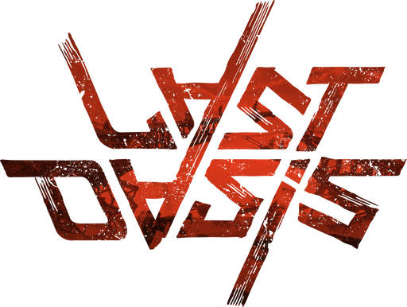

<!-- readme-top -->

<!-- LOGO -->
 

  

  <h1 align="center">Last Oasis Mods</h1>

  

    where everything started...
     
     
     
    <a href="https://github.com/iamBVC/Last-Oasis-Mods/issues">Request Changes</a>
     
  

<!-- TABLE OF CONTENTS -->
  
Table of Contents

  <ol>
    <li>
      <a href="#getting-started">Getting Started</a>
      <ul>
        <li><a href="#prerequisites">Prerequisites</a></li>
        <li><a href="#installation">Installation</a></li>
      </ul>
    </li>
    <li>
      <a href="#how-to-edit-ue-files">How to edit UE files</a>
    </li>
  </ol>
 
 

<!-- GETTING STARTED -->
## Getting Started

Modding the game is a time consuming process that requires:
<ol>
  <li>
    Unpacking the encrypted .pak files
  </li>
  <li>
    Find the files you are interested in
  </li>
  <li>
    Figure out how to edit it
  </li>
  <li>
    Repack the files
  </li>
</ol>

<!-- Prerequisites -->
### Prerequisites
First off you must download our <a href="https://github.com/iamBVC/Last-Oasis-Mods/blob/master/Tools">Tools</a>. 
Inside this folder you'll find all the programs needed for unpacking, editing and repacking the game files.
 

<!-- Installation -->
### Installation
<ol>
  <li>
    Extract the zip file containing all the tools needed.
  </li>
  <li>
    Open the file "config.bat" and replace the paths to the server and client pak folder.
  </li>
  <li>
    Execute "unpack_client.bat" and wait until all the pak files are extracted.
	The folder "Last_Oasis_Client" will be created with all the UE assets of the game
	Take in mind that client and server files are the same, but all the textures and models are missing, so it's better to use the client files for creating the mods for client and server.
  </li>
  <li>
    Open "umodel_client.bat" to navigate the unpacked files
  </li>
  <li>
    Set save path to "./saved"
  </li>
  <li>
    Set export path to "./Unpacked_Client"
  </li>
  <li>
    Select the .uasset/.umap files you want to modify, right click on them and select "save packages".
    The packages will be saved on the "saved" folder.
  </li>
  <li>
    After editing the files, launch "pack_auto_P.bat" to create the empty "pakchunk9017-WindowsServer_P" folder.
  </li>
  <li>
    Move the "saved" folder content inside "pakchunk9017-WindowsServer_P" folder.
  </li>
  <li>
    Launch "pack_server_auto.bat" to pack the mods and copy it in the server pak folder.
  </li>
  <li>
    Launch "pack_client_auto.bat" to pack the mods and copy it in the client pak folder.
  </li>
  <li>
    You can also drag the "pakchunk9017-WindowsServer_P" folder containing the mods on "drag_on_me_to_pack.bat" to pack it and save the .pak file inside the Tools folder.
  </li>
  <li>
    You can also drag an already packed mod on "drag_on_me_to_unpack.bat" to unpack it.
  </li>
  <li>
    Before starting the client/server:
     - In the server pak folder, make a copy of the file "pakchunk9017-WindowsServer.sig" with name "pakchunk9017-WindowsServer_P.sig".
	 - In the client pak folder, make a copy of the file "pakchunk9017-WindowsClient.sig" with name "pakchunk9017-WindowsClient_P.sig".
  </li>
  <li>
    Copy "OasisLauncher.exe" in your client folder to bypass EAC and use our backend.
  </li>
  <li>
    Start the game and enjoy your mods :)
  </li>
  <li>
    Use "start_client.bat" if you don't want to use our client mods.
  </li>
</ol>
 
 

<!-- How to edit UE files -->
## How to edit UE files
<ol>
  <li>
    Open "UAssetGUI.exe".
  </li>
  <li>
    Set UE version to 4.25
  </li>
  <li>
    Open the .uasset/.umap file you wanna edit
  </li>
  <li>
    Change the values of the tables
  </li>
  <li>
    Save the file
  </li>
  <li>
    Delete .bak files before packing the mod folder
  </li>
</ol>
 
 

(<a href="#readme-top">back to top</a>)

