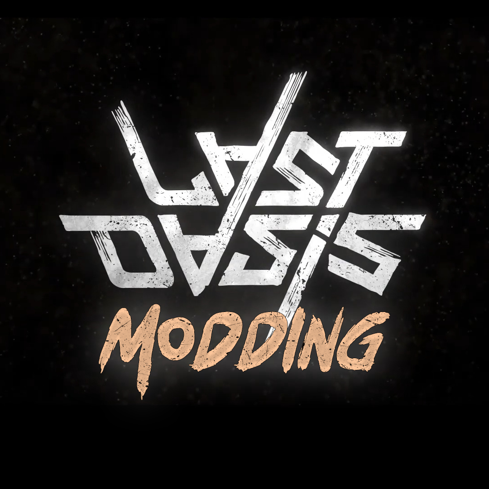

<!-- readme-top -->

<!-- LOGO -->
 

  

  <h1 align="center">Last Oasis Mods</h1>

  

    where everything started...
     
     
     
    <a href="https://github.com/iamBVC/Last-Oasis-Mods/issues">Request Changes</a>
     
  

<!-- TABLE OF CONTENTS -->
  
Table of Contents

  <ol>
    <li>
      <a href="#getting-started">Getting Started</a>
      <ul>
        <li><a href="#prerequisites">Prerequisites</a></li>
        <li><a href="#installation">Installation</a></li>
      </ul>
    </li>
    <li>
      <a href="#how-to-edit-ue-files">How to edit UE files</a>
    </li>
  </ol>
 
 

<!-- GETTING STARTED -->
## Getting Started

Modding a private server is a time consuming process that requires:
<ol>
  <li>
    Unpacking the encrypted server .pak files
  </li>
  <li>
    Find the files you are interested in
  </li>
  <li>
    Figure out how to edit it
  </li>
  <li>
    Repack the files
  </li>
</ol>

<!-- Prerequisites -->
### Prerequisites
First off you must download our <a href="https://github.com/iamBVC/Last-Oasis-Mods/blob/master/Tools.zip">Tool package</a>. 
Inside this package you'll find all the programs needed for unpacking, editing and repacking the server files.
 

<!-- Installation -->
### Installation
<ol>
  <li>
    Extract the zip file containing all the tools needed, then open the files "unpack_server.bat" and replace the path to the server's pak folder.
  </li>
  <li>
    Execute "unpack_server.bat" and wait until all the pak files are extracted.
Now a folder named "Last_Oasis_Server" has been created, with all the unpacked UE assets files inside.
  </li>
  <li>
    Open "umodel.bat" to navigate the unpacked files, than select the .uasset/.umap files you want to modify, right click on them and select "save packages".
    Save the packages inside a folder named "pakchunk9017-WindowsServer_P".
  </li>
  <li>
    Open "UAssetGUI.exe" to edit the data files, Select version 4.25.
  </li>
  <li>
    Once you're done, drag the folder "pakchunk9017-WindowsServer_P" over the file "pack.bat".
    A file named "pakchunk9017-WindowsServer_P.pak" will be created.
  </li>
  <li>
    Copy the new pak file inside you server Pak folder.
  </li>
  <li>
    Make a copy of the file "pakchunk9017-WindowsServer.sig" and rename it to "pakchunk9017-WindowsServer_P.sig"
  </li>
  <li>
    Start the server and enjoy your mod :)
  </li>
</ol>
 
 

<!-- How to edit UE files -->
## How to edit UE files
 
 

(<a href="#readme-top">back to top</a>)

